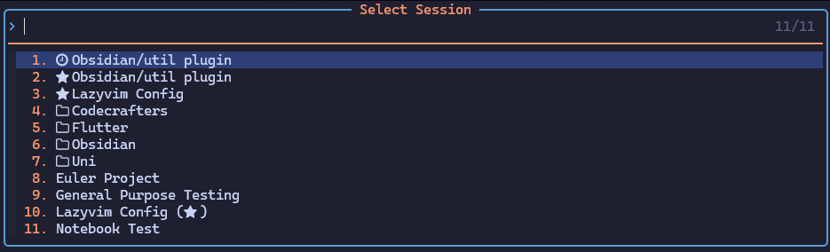

# AutoSession UI

<https://trello.com/b/eluOVjQc/session-picker>

Name, sort and pick sessions made with the [auto-session](https://github.com/rmagatti/auto-session) plugin.



(This plugin is not affiliated with the author of the original [auto-session](https://github.com/rmagatti/auto-session) plugin in any way. It's just a UI script I wrote for myself when using the original plugin)

## 📦 Installation

[Lazy.nvim](https://github.com/folke/lazy.nvim):

```lua
return {
  "MinecraftPotatoe/auto-session-ui",
  opts = {
  },
  init = function()
    -- Set your keybindings here
    local wk = require("which-key")
    local asu = require("auto-session-ui")
    wk.add({
      { "<leader>s", group = "Sessions", icon = "" },
      { "<leader>sp", desc = "Pick session", callback = asu.pick_session },
      { "<leader>sa", desc = "Add/Rename session", callback = asu.add_current_session },
      { "<leader>sr", desc = "Remove session", callback = asu.remove_current_session },
      { "<leader>sf", desc = "Toggle current session as favorite", callback = asu.favorite_current_session },
    })
  end,
  dependencies = {
    "rmagatti/auto-session"
  }
}
```

If you are not using lazy.nvim or another package manager, MAKE SURE `require("auto-session-ui).setup({})` IS CALLED

## ⚙️ Configuration

Default settings (you don't have to copy these into your config):

<!-- config:start -->

```lua
local defaults = {
}
```

<!-- config:end -->

## 📢 Commands

```viml
:AutoSessionUI save " saves a session based on the `cwd` in `root_dir`
```
